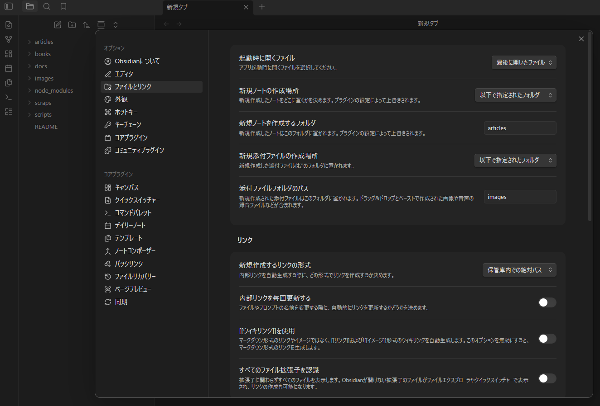

##  ZennのGitHub連携をしてみました
兼ねてより気になっていた`Zenn Connect`(GitHub連携)を導入しました。
最近[Obsidian](https://obsidian.md/)を使い始めたので`Zenn`の記事を`Obsidian`で書きたいと思い導入しました。
ローカル環境で自分の好きなエディタで記事を書けるのは良いですね。

なんですが、少し困った事がありまして。
## ローカルアプリとの画像パスの違い
`GitHub`と連携してリモートリポジトリにプッシュしたら自動的に`zenn.dev`へデプロイしてくれるサービスは非常に便利なのですが、ディレクトリ構造とパスには制約があります。

私の`Vault`の構造は以下のようになっていて、メモや`note`記事用のディレクトリと同列で`Zenn`の記事用のディレクトリがあります。
```
Vault/
  ├── attachments/
  ├── bases/
  ├── canvas/
  ├── memos/
  ├── note-contents/
  ├── scripts/
  ├── templates/
  ├── web-clips/
  └── zenn-contents/  # Zennのプロジェクト(リポジトリ)のルートディレクトリ
        ├── articles/
        │    ├── example1.md
        │    └── example2.md
        ├── images/
        │    ├── example1.png
        │    └── example2.png
        └── books/
              └── my-awesome-book/
                    ├── config.yaml
                    ├── cover.png
                    ├── example3.md
                    ├── example4.md
                    └── example5.md
```
理由はメモに加えて自分の`note`記事や`Zenn`記事の中からタグやキーワードで検索を掛けたい事があるからです。
「以前記事にした事があると思うけどなんだったっけ？」というシチュエーションは割とあるし、それがメモだったのか記事にしたのかはあやふやである事の方が多いのです。
### Zenn.devでの画像へのパス
Zenn.devで画像を表示するには(https～で始まるURLを除く)リポジトリのルート直下に`articles`,`books`,`images`というディレクトリを作成して記事は`articles`配下に、画像は`images`配下に配置しなければいけません。
その上で記事内で`images`ディレクトリの画像を参照する時には以下のようにリポジトリ内での絶対パスを記述する必要があります。
```

```
### Obsidianでの画像へのパス
ところが、`Obsidian`では画像へのパスは`Vault`内での絶対パスかファイルに対する相対パスでなければ`Obsidian`が解決できず表示されません。

また、`Obsidian`以外(`VS Code`など)でもおそらく多くのローカルアプリケーションではファイルからの相対パスで表されると思います。
```

```
このパスの違いを吸収するのが意外と「ややこしい」のです。

調べてみると、この問題に困っていた人は割といらっしゃるみたいで、2022年にも公式コミニティーで要望が出されていて、開発者の方も対応の意思があられたようですが、技術的に少しややこしく、時間がかかるとの返答をされています。

https://github.com/zenn-dev/zenn-community/issues/380

それから数年経ちますが、まだ解決していない所を見ると、やはり技術的にややこしかったのだと思います。
## 解決方法の模索
### VaultとリポジトリのRootを合わす
`Obsidian`でもいくつか解決方法があるようですが、一番手っ取り早いのは`Vault`のルートをリポジトリのルートとしてしまう事です。
`Zenn`執筆用の`Vault`としてメインの`Vault`とは別に作成した方が良いと思います。

そして、設定で新規作成するリンクの形式を「**保管庫内での絶対パス**」にしておけばパスの解決が`Zenn.dev`と同じになります。

ついでに新規添付ファイルの作成場所を`images`フォルダにしておけば、スクショ等を撮った時のクリップボードを記事に貼り付けると自動的に`images`ディレクトリに画像を保存した上で参照してくれるので効率が良いです。

#### しかし、この方法には問題が
:::message alert
パスが同じになるので良いかと思いきや、`Obsidian`でこの`images`ディレクトリの画像を記事にドラッグアンドドロップしたら自動挿入されるパスは以下のようになります。
```

```

非常に惜しいですが`images`の前に`/`がありません。これが無いだけでも`Zenn.dev`では表示されません。
:::
ですが、`images`の前に`/`がある事は双方で大丈夫で`Obsidian`でも表示されます。
なので、この場合は`images`の前に`/`が無ければ`/`を付け足すというロジックがあれば解決できるという事になります。
実際に`Obsidian`でそういう制御は可能で検証済みです。
#### Vault外のファイルの閲覧に少々難がある
記事を書くに当たって何も見ずに書くという事は無いと思います。それこそ気になってメモしておいた事や、`Obsidian`のwebクリッパーでネットの情報を`markdown`化した資料などを別のタブで開いて閲覧しながら執筆したいというシーンはよくあると思います。

ところが、`Vault`を`Zenn`リポジトリに限定してしまうと外部ファイルの閲覧が難しくなってしまいます。メモやwebクリップ等は`Zenn`の記事を書くための専用のファイルという訳では無いので`Zenn`のリポジトリの中には置きたくない。

かといってリポジトリの外へ置いておくとそれらの閲覧には
- もう一つ資料閲覧用の`Valut`を開く
- 他の資料閲覧用アプリケーションを立ち上げる
- シンボリックリンクを作成する  

といった何らかの手段が必要になってきます。この辺はトレードオフと言った所でしょうか。
### その他の方法
記事を作成して`GitHub`へプッシュする直前に一括してパスを変換する。という方法も考えましたが、その方法だとローカルのファイルが上書きされてしまうので、過去の記事を修正したいとか追記したいと言う時に`Obsidian`で画像が表示されていない状態になります。

そして、任意のタイミングで手動で変更するというのはうっかり忘れてしまったりするので、できるだけ避けたいところです。
## GitHub Actionsで解決する
`Vault`のルートをリポジトリのルートとしない場合はこの方法が良いのではないでしょうか？
1. ローカルでは相対パスを使い画像を表示する。
2. 記事が完成したら`GitHub`へプッシュする
3. `GitHub Actions`が発動しパスを書き換えるスクリプトを実行
4. `GitHub Actions`が書き換えが完了したものをデプロイ用の別のブランチへプッシュする
5. `Zenn Connect`はそのデプロイ用のブランチを監視してデプロイする
というフローです。

:::message
デプロイ用のブランチにプッシュしているのは、パスの書き換えが完了する前に非同期にデプロイされたら困るので、確実にパスが書き換えられた後の状態をデプロイするためです。

また、`main`のブランチはそのままなので`clone`や`pull`する場合でも元の状態のまま取得できるというメリットもあると思います。
:::

3,4,5のフローは自動化されるので`GitHub`へプッシュすると自動的にパスが書き換えられ`Zenn.dev`へデプロイされるという事になります。
### ファイルの配置
先ずはローカルリポジトリに`GitHub Actions`に必要なディレクトリを作成し必要なファイルを配置します。
今回の場合はワークフローを記述した`YAML`ファイルとパスの変換を行うスクリプトの`Node.js`のファイルです。
```
zenn-contents/
  ├── .github/
  │      └── workflows/
  │             └── zenn-deploy.yml    # ワークフロー
  ├── articles/
  ├── books/
  ├── images/
  ├── node_modules/
  ├── scripts/
  │      └── convert-image-paths.js    # パス書き換えScript
  ├── .gitignore
  ├── package-lock.json
  ├── package.json
  └── README.md
```
### ワークフローのYAML
```yml: zenn-deploy.yml
name: Zenn Deploy

# 書き込み権限
permissions:
  contents: write

# mainブランチへのプッシュがトリガー
on:
  push:
    branches:
      - main

jobs:
  convert-and-deploy:
    runs-on: ubuntu-latest

    steps:
      - name: Checkout main
        uses: actions/checkout@v4
        with:
          fetch-depth: 0

      - name: Setup Node.js
        uses: actions/setup-node@v4
        with:
          node-version: 22
        
        # ランタイムのインストール
      - name: Install runtime deps needed for script
        run: npm install glob --no-save

        # パス変換スクリプト
      - name: Run image path converter
        run: node scripts/convert-image-paths.js

      - name: Commit converted files to zenn-deploy
        run: |
          git config user.name "github-actions"
          git config user.email "github-actions@github.com"
          git checkout -B zenn-deploy
          git add -A
          git diff --cached --quiet || git commit -m "chore: convert image paths for Zenn"
          git push origin zenn-deploy --force
```
### パス変換スクリプトNode.js
```js: convert-image-paths.js
const fs = require("fs");
const glob = require("glob");

// 対象ディレクトリ（articles / books）
const TARGET_DIRS = ["articles/**/*.md", "books/**/*.md"];

const REL_IMG_REGEX = /(!\[[^\]]*\]\()(\.{1,}\/)+images\/([^)\s]+)(\))/g;

//画像パスを変換
const convertImagePaths = (text) => {
  const lines = text.split("\n");
  let inCodeBlock = false;
  const result = [];
  // コードブロックフェンス
  const FENCE_REGEX = /^ {0,3}(`{3,}|~{3,}).*$/;

  for (let line of lines) {
    // コードブロックの開始/終了かを判定
    if (FENCE_REGEX.test(line)) {
      inCodeBlock = !inCodeBlock;
      result.push(line);
      continue; // フェンス行自体は置換対象外
    }

    // コードブロック外の場合のみパスを置換
    if (!inCodeBlock) {
      line = line.replace(
        REL_IMG_REGEX,
        (_m, prefix, _dots, filename, suffix) =>
          `${prefix}/images/${filename}${suffix}`,
      );
    }

    result.push(line);
  }

  return result.join("\n");
};

// ファイル単位の処理
const processFile = (filePath) => {
  const original = fs.readFileSync(filePath, "utf8");
  const converted = convertImagePaths(original);

  if (original !== converted) {
    fs.writeFileSync(filePath, converted, "utf8");
    console.log(`Converted: ${filePath}`);
  } else {
    console.log(`No change: ${filePath}`);
  }
};

// メイン処理
const main = () => {
  TARGET_DIRS.forEach((pattern) => {
    const files = glob.sync(pattern);
    files.forEach(processFile);
  });
};

main();
```

リポジトリに以上のような構成でファイルを配置して`GitHub`へプッシュすると別のブランチ(デプロイ用: zenn-deploy)が自動的に作成されるので、次は`Zenn`での設定を行います。

## Zennでの設定
`Zenn`へログインした状態でアカウントのアイコンから`GitHub`からのデプロイ→リポジトリ設定タブに入ります。
連携中のリポジトリの「設定を変更」ボタンを押して新しいブランチ名という所に新しく作成されたデプロイ用のブランチを指定します。

以上の設定が問題なく完了すると、ローカルでは相対パスで画像を表示し、`GitHub`へプッシュすると自動的にパスを変換して`Zenn.dev`でも閲覧できる状態になるという夢の環境が手に入る事になります。
### しかし、この方法にも欠点が
:::message alert
相対パスを使用するという事は`npx zenn preview`で画像は表示されません。
`Zenn`での表示チェックは非公開で投稿して確認するといった方法になってしまいます。
:::
投稿するまでどのように表示されるのかが分からないというのは大きなデメリットですね。
完璧では無くても仕上がりに近いイメージをプレビューできない物でしょうか？

## という訳でプラグインを作る事にしました
どうしても`Obsidian`で快適に`Zenn`の記事を書いてみたいというのが諦めきれなくて、自作の`Obsidian`プラグインを現在作っています。(とはいえほぼほぼバイブコーディングですが)

markdownの仕上がりプレビューには`npx zenn preview`を利用せずに`Obsidian`のレンダリングで`Zenn`風のスタイルを再現してしまおうという趣旨のプラグインです。

まだまだバグが多くて完成はいつになるやらですが...
https://x.com/2ndillness/status/2026251297905881245